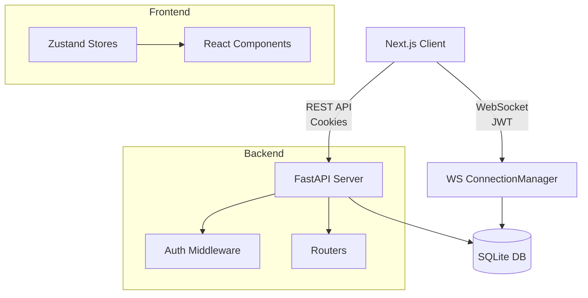
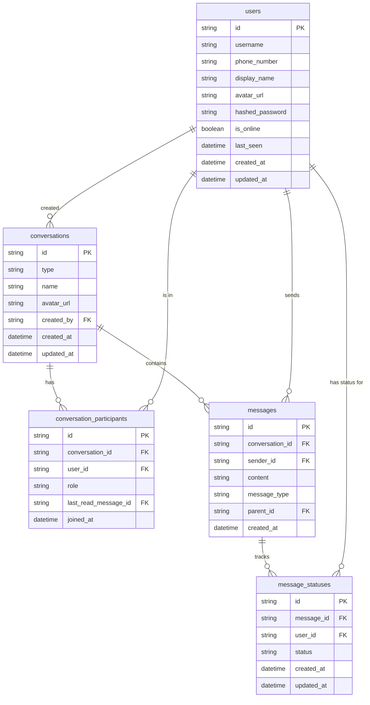

# Signal Clone

A fully functional, visually accurate clone of Signal Messenger (desktop web version) built as a complete full-stack application.

This project implements core messaging features including real-time text chat, group messaging, read receipts, typing indicators, presence, and session-based authentication, utilizing a modern, scalable tech stack.

## Tech Stack

- **Backend:** Python, FastAPI, SQLite, SQLAlchemy, WebSockets, PyJWT
- **Frontend:** Next.js 14 (App Router), React, TypeScript, Tailwind CSS, Zustand, shadcn/ui
- **Authentication:** `httpOnly` cookie sessions + Short-lived JWTs for WebSockets
- **Key Features:**
  - Real-time text chat (1:1 and Groups) with typing indicators and presence
  - Optimistic UI updates with transient "sending" statuses
  - Live unified search for existing conversations and global contacts
  - Avatar picker during onboarding and profile settings
  - Delivery and read receipts via WebSocket

---

## Architecture Diagram



---

## Database ERD



---

## Setup Instructions

### Backend

1. Navigate to the backend directory:
   ```bash
   cd backend
   ```
2. Install dependencies:
   ```bash
   pip install -r requirements.txt
   ```
3. Seed the database (creates users like `alice` and `bob`, and sample conversations):
   ```bash
   python -m app.seed
   ```
4. Run the development server:
   ```bash
   python -m uvicorn app.main:app --reload
   ```

### Frontend

1. Navigate to the frontend directory:
   ```bash
   cd frontend
   ```
2. Install dependencies:
   ```bash
   npm install
   ```
3. Run the development server:
   ```bash
   npm run dev
   ```

The app will be available at `http://localhost:3000`. Test login: `alice` / `123456`.

---

## API Reference

### Authentication
- `POST /auth/register` - Create a new user (returns user info)
- `POST /auth/login` - Login with identifier and OTP (sets `session_token` cookie)
- `POST /auth/verify-otp` - Verify OTP
- `POST /auth/logout` - Clear `session_token` cookie
- `GET /auth/me` - Get current user profile
- `GET /auth/ws-token` - Get a short-lived (60s) JWT for authenticating WebSocket connections

### Conversations
- `GET /conversations` - List conversations for current user
- `POST /conversations` - Create a new conversation (direct or group). `participant_ids` required.
- `GET /conversations/{id}` - Get full details and participant list of a conversation
- `PATCH /conversations/{id}` - Update conversation info (name/avatar)
- `POST /conversations/{id}/members` - Add a member to a group
- `DELETE /conversations/{id}/members/{user_id}` - Remove a member from a group

### Messages
- `GET /messages/{conversation_id}` - List messages in a conversation (paginated)
- `POST /messages/{conversation_id}` - Send a new REST message (mostly used by systems, WS is preferred for chat)

### Users
- `GET /users?search=query` - Search users by username or display name to add to chats

---

## WebSocket Protocol

Clients connect to `ws://localhost:8000/ws?token=<ws_token>`.

### Client -> Server Events

```json
{
  "type": "message:send",
  "conversation_id": "uuid",
  "content": "Hello!"
}

{
  "type": "typing:start",
  "conversation_id": "uuid"
}

{
  "type": "typing:stop",
  "conversation_id": "uuid"
}

{
  "type": "message:read",
  "message_ids": ["uuid1", "uuid2"]
}
```

### Server -> Client Events

```json
{
  "type": "message:new",
  "message": { /* Message Object */ }
}

{
  "type": "typing:update",
  "conversation_id": "uuid",
  "user_id": "uuid",
  "is_typing": true
}

{
  "type": "presence:update",
  "user_id": "uuid",
  "is_online": true,
  "last_seen": "iso-date"
}

{
  "type": "message:status",
  "message_id": "uuid",
  "user_id": "uuid",
  "status": "delivered"
}
```
